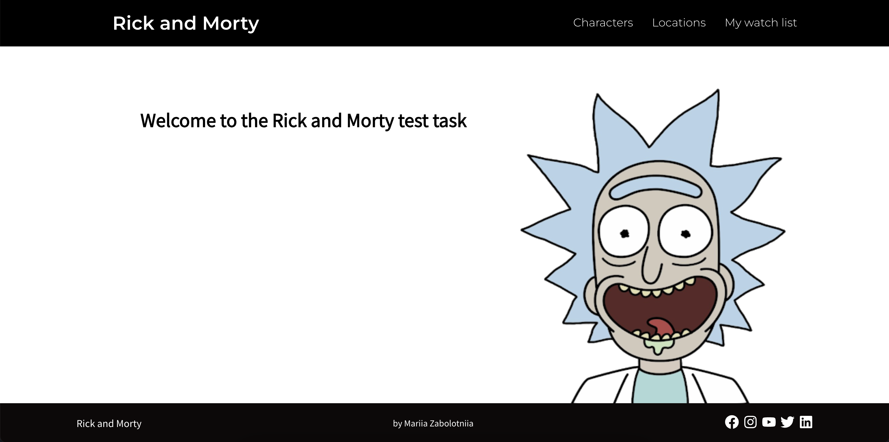
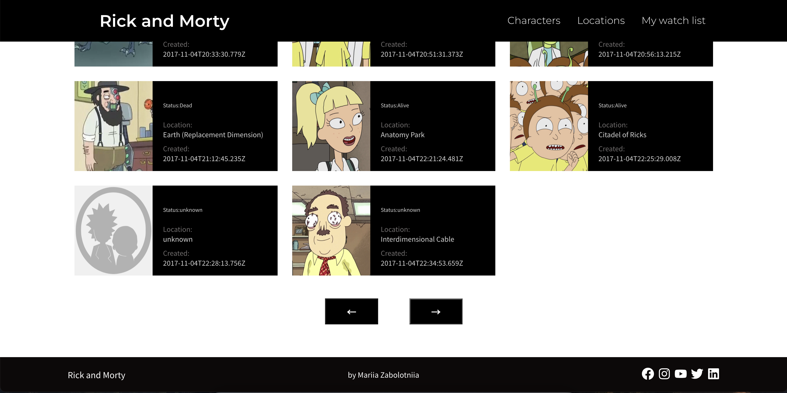
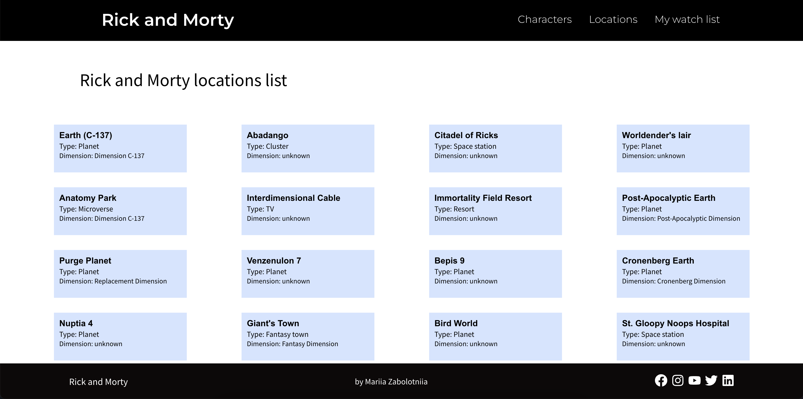
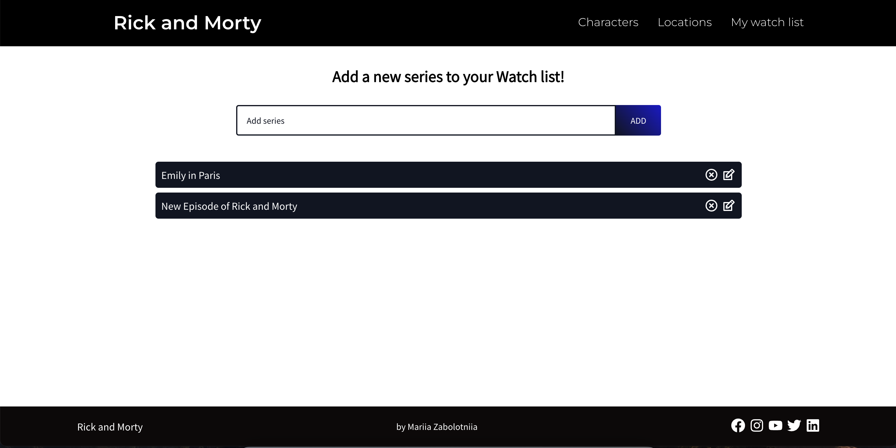

# Rick and Morty Web App

## Description

The Rick and Morty Web App serves as a learning platform for exploring such technologies as **React, Redux, and Styled Components**, while also focusing on the **integration of external APIs**.

The app provides such functionality as displaying the **list of characters and locations** from Rick and Morty movie. The dynamic content is seamlessly fetched and managed through the external API (https://rickandmortyapi.com/) and the efficient storage system is offered by Redux.
User is also able to navigate through content using **pagination**.

Moreover, the app offers a user-friendly interface for maintaining a personalized **watchlist of movies**. It's also possible to **edit or delete items** from the list.

## Technology

- [React](https://react.dev/)
- [Redux](https://redux.js.org/)
- [Styled Components](https://styled-components.com/)

## Getting started

To set up and run the project on your local machine, follow these steps:

### 1. Clone the project repository to your local environment.

### 2. `npm install`
Install all the project dependencies necessary to bundle the app.

### 3. `npm start`
Run the app in the development mode
Open [http://localhost:3000](http://localhost:3000) to view it in the browser. The page will reload if you make edits.

## Demo

## Acknowledgments
This website was inspired by a tutorial on YouTube. Special thanks to the tutorial creator for providing valuable guidance and insights.
